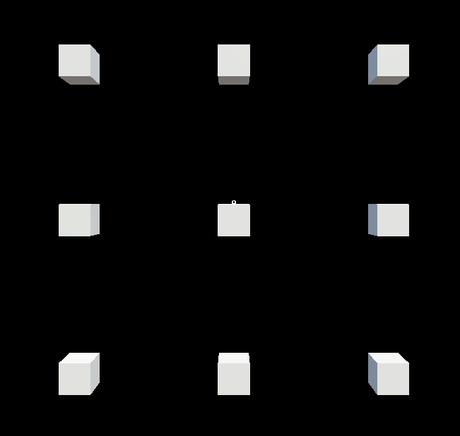
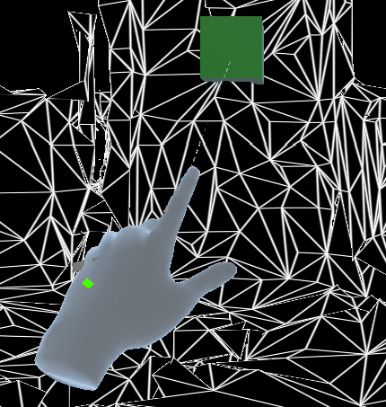
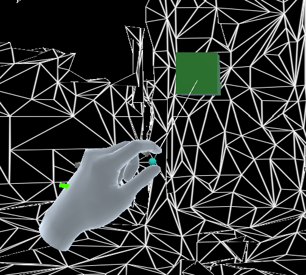
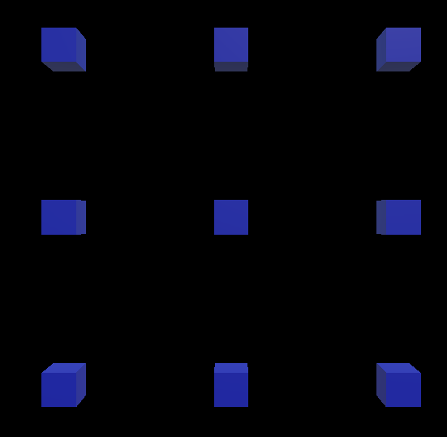

# Thesis Project

- [Thesis Project](#thesis-project)
- [1. Introduction](#1-introduction)
- [2. Technology](#2-technology)
  - [2.1. Hololens \> Spatial Mapping](#21-hololens--spatial-mapping)
  - [2.2. Hololens \> Spatial Audio](#22-hololens--spatial-audio)
  - [2.3. Hololens \> Voice Input](#23-hololens--voice-input)
  - [2.4. Unity \> Raycast](#24-unity--raycast)
- [3. Analysis Phase](#3-analysis-phase)
- [4. Development Phase](#4-development-phase)
  - [4.1. Voice Commands](#41-voice-commands)
- [5. How to use](#5-how-to-use)
- [6. Appendix](#6-appendix)

# 1. Introduction
The scope of this thesis project is to develop an app for Hololens 2, which will assist users who face vision impairment (partial or complete vision loss) t and would like to navigate in a specific area, unknown to them.

# 2. Technology
The technology (devices, software), which was used during the development of the app is:
- Hololens 2
  - We decided to use an AR device in order to take advantage of its compact design along with the hardware and software which has already been implemented for it, making the development process easier.
- Unity
  - It was decided to proced with Unity instead of Javascript due to the vast range of documentation, tutorials and examples
- Mixed Reality Feature Tool
  - Mixed Reality Toolikit Foundations (version 2.7.3)
  - Mixed Reality Toolkit Standard Assets (version 2.7.3)
  - Mixed Reality OpenXR Plugin (version 1.4.0)
- Hololens Emulator

## 2.1. Hololens > Spatial Mapping
...

## 2.2. Hololens > Spatial Audio
...

## 2.3. Hololens > Voice Input
...

## 2.4. Unity > Raycast
...

# 3. Analysis Phase
...

# 4. Development Phase
...

## 4.1. Voice Commands
|Voice Command | Description |
| ------------ | ----------- |
| `Scan` | 9 rays are casted from multiple positions ([Raycasts Origin Point](#6-appendix)), as they are displayed in the image:

The first row is placed at the height of user's gaze. The distance between each Origin Point with its adjacent ones is 0.5 units[^1]. When a ray hits the mesh[^2] of the room, then an [alert box](#6-appendix) is placed at the hit point in order to alert the user for an obstacle. One alert box correspond to each raycast. If the ray doesn't hit the mesh within 5 units[^1], then its alert box is deactivated. If the user uses the command again, the alert boxes are moved to the new hit points.  **<u>Note</u>**: If the user turns his gaze, the alert boxes stay in their positions. For the alert boxes to follow the movement of the user's head, use the command `Continuous Mode`. |
| `Stop` | All alert boxes are deactivated. |
| `Continuous Mode` | When this mode is activated, then the rays (which have been selected to be activated for this mode) are casted in each frame. The alert boxes are placed on the hit points. Since the rays are casted in each update, this means that the alert boxes follow the movement of user's head. Using the same command, the mode is deactivated.  **<u>Note</u>**: For now, only one ray is casted in this mode at the height of user's gaze. |
| `Hands Mode` | When this mode is activated, then, if the user place his hand in front of him, at the end of the pointer, which extends from his arm and works as a raycast, an alert box is placed in the hit point between the pointer and the mesh[^2].

If no point of the mesh is hit by the pointer, the alert box is deactivated. If the user uses the same command, the mode is deactivated.  **<u>Note</u>**: If the user does the pinch gesture, the sound of the alert box is temporarily muted. If the user "release" the gesture, the sound is unmuted. 

 |

[^1]: Unity doesn't have a specific unit of measurement for distances, so the generic term **units** is used. We can accept that: $1 unit \approx 1 meter$.
[^2]: The mesh is retrieved from the spatial mapping.

# 5. How to use
- Wear the Hololens 2 headset and launch the app
- On startup, a scan of the environment will be done (in the direction of user's gaze) in order to retrieve the mesh (spatial mapping). This scan is done in intervals of 3.5 seconds.
- The user can use any of the available [voice commands](#41-voice-commands).
  - It is suggested the user to use frequently the `Scan` command.

# 6. Appendix
- <a name="appendix-alert-box">**Alert Box**</a>: A GameObject, to which has been attached an Audio Source that plays a sound in order to alert the user. In the app, they are visualized as a blue or green cube.\

  

- <a name="appendix-origin-point">**(Raycast) Origin Point**</a>: It is the point (coordinates) from which a ray is casted. In the app, it is visualized as a white box.\

  

